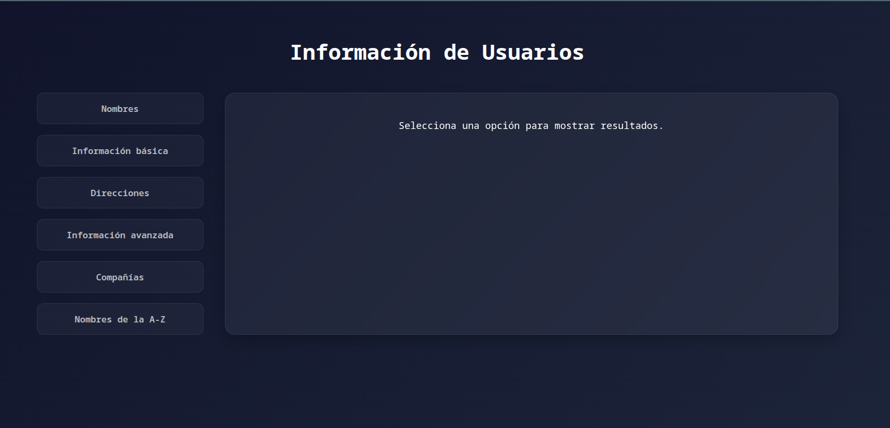
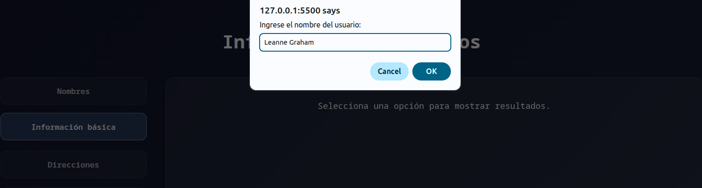
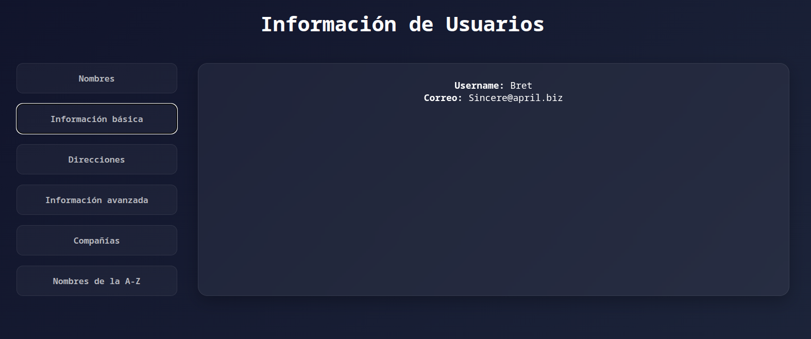
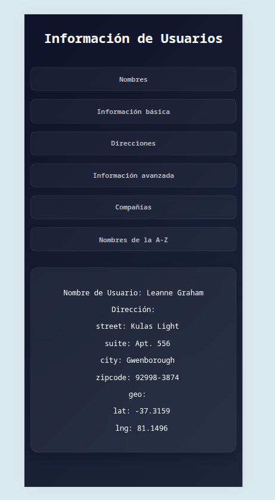

# Actividad Final Módulo 4 💻

## Bootcamp Talento Digital

### Objetivo 📜:

#### Creación de un panel de usuario básico , para obtener datos de los usuarios

¿ Cómo usarlo el panel ? Ingresa el nombre solicitado en el prompt para obtener datos del usuaria/o

**Pasos:**

1. Ingresar y seleccionar Información básica

2. Se desplegará un prompt para ingresar el nombre y dar enter

3. Salida de datos :
   

#### Para ello debemos 💡:

- Consumir una API externa
- Procesar los datos recibidos y mostrarlos dinámicamente en el DOM.
- Ejecutar fetch o cualquier manejo de datos asíncronos.
  - En este caso ocupamos Fetch para los datos asíncronos.
- Manejo de promesas -- > _manejo de errores_
- Clases en JS

### Extras para la mostrar dinamicamente algunos datos

- Recursividad para renderizar datos anidados.

### Versión móbile

- En Mobile lo verás así :

Autoría :💻 [Luisa Romero](https://github.com/luisaromero)
